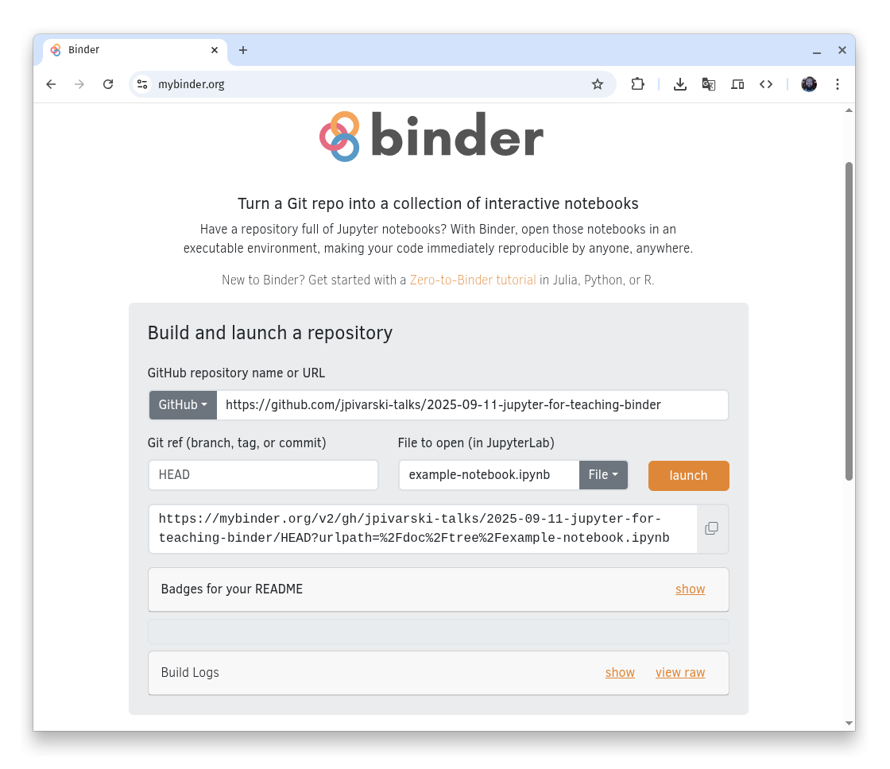
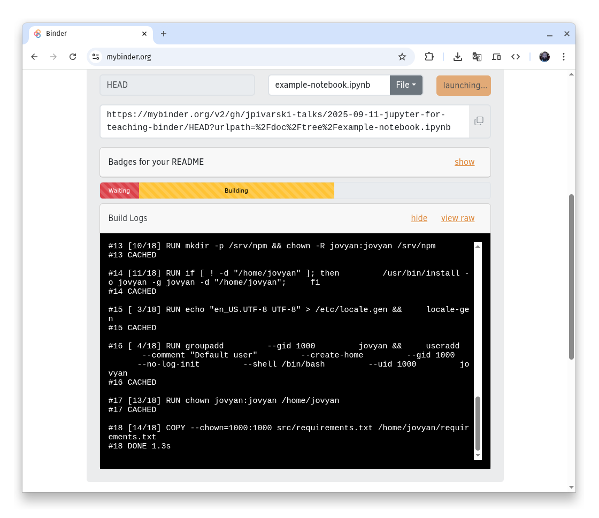
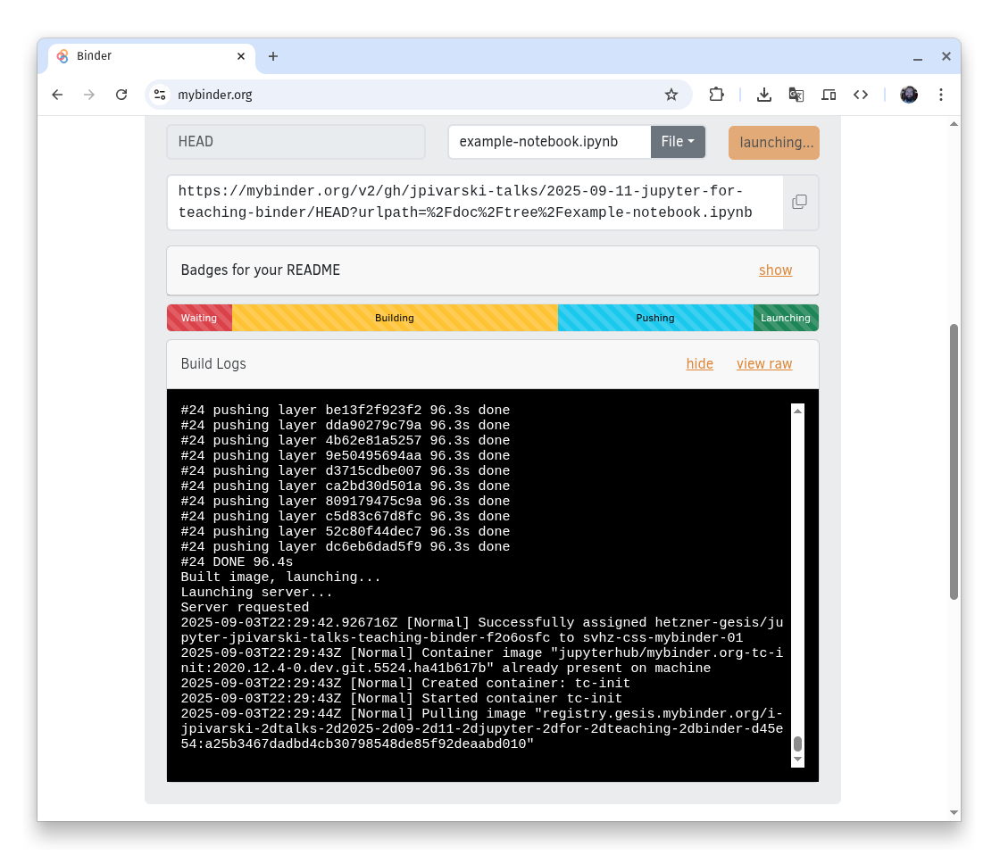
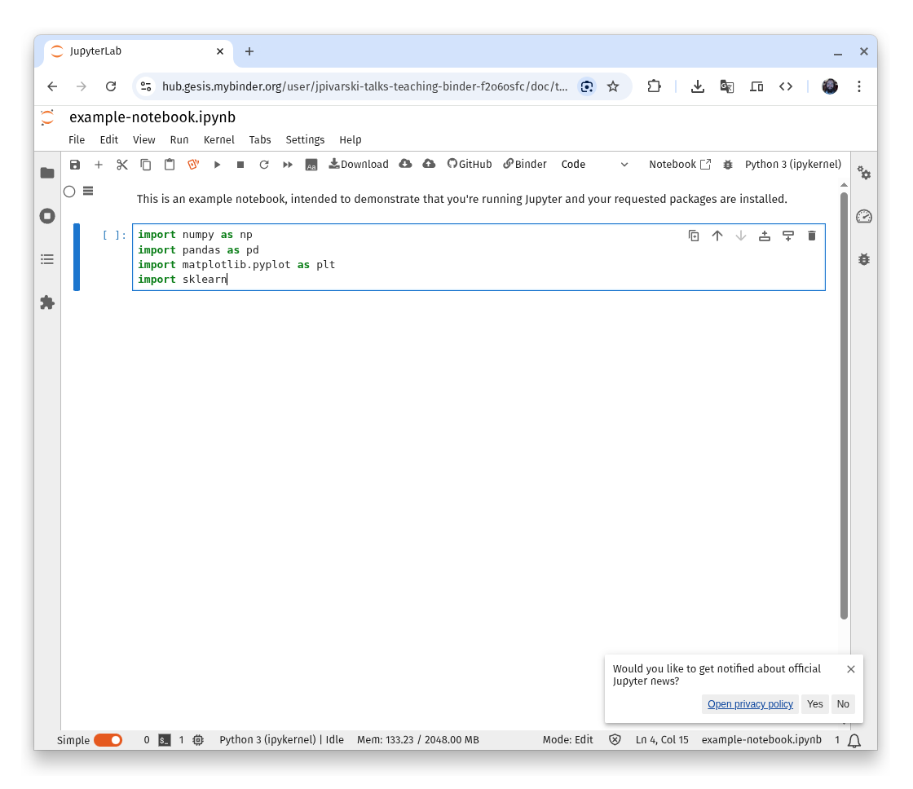

# Jupyter for Teaching (2025-09-11): Binder example

In this example, we launch Jupyter in Binder.

Binder runs code on a free cloud, [financially supported by donations](https://mybinder.readthedocs.io/en/latest/about/supporters.html). Because this support wavers, you can't always rely on computational resources being available, especially if you need to install any large packages. (Google pulling out in 2022 was a major blow, but it seems to be better as of this writing...)

Also, student connections can auto-logoff if they're not active, and any saved files or changes to the notebooks will be lost. The best way to use Binder is as an ephemeral resource, running code in a pre-written notebook, rather than a workspace for students to develop solutions to a long exercise. (They'll be very unhappy if hours of work on a hard problem set disappears!)

Launching can take several minutes, but the process is very easy: you only need to provide a URL like this one:

https://mybinder.org/v2/gh/jpivarski-talks/2025-09-11-jupyter-for-teaching-binder/HEAD?urlpath=%2Fdoc%2Ftree%2Fexample-notebook.ipynb

## How to set up the repository

As a teacher, you need to set up a public repository like this one. Students just click the URL you give them.

The only configuration you need is a [requirements.txt](https://github.com/jpivarski-talks/2025-09-11-jupyter-for-teaching-binder/blob/main/requirements.txt) file to pip-install the necessary packages (including `jupyterlab` itself). If you want to install with conda instead of pip, add an [environment.yml]() instead of the `requirements.txt`. You can do additional configuration, such as adding Linux packages with `apt get`, by adding commands to a `.binder/postBuild` file, but this isn't necessary. ([See these instructions](https://mybinder.readthedocs.io/en/latest/examples/sample_repos.html) if you're interested.) The example in this repository is the _simplest_ case.

### Step 1

Once you have a GitHub repository, go to [mybinder.org](https://mybinder.org/) and fill in the fields. Put the URL to your GitHub repository in the first field and (optionally) a notebook to auto-open in the "File to open" field.

This form constructs a URL for you in the field below the "launch" button. **That's the URL you need to copy and give to your students.**

### Step 2

After pressing "launch" or opening the URL, Binder will start building the image. **This can take several minutes,** but you don't need to do anything other than watch it load. If you click on the "show" link next to "Build Logs", you can see the terminal output as it builds. That's useful for debugging if something goes wrong (or it's taking an excessively long time).

_(Time passes...)_

### Step 3

Now JupyterLab is running, and you can treat this as a normal JupyterLab installation, except that it's running on Binder's servers instead of your own computer.

## Tricks to speed up launch

Binder needs to do two things to launch: (1) build a disk image with all of your notebooks and software packages installed and (2) run it. It skips step (1) if it already has a cached disk image.

Any changes that you make to the repository, such as changing text in the README.md file, tells Binder that its cache is not up to date and it needs to rebuild. One way to make launching faster is to avoid making any changes to the repository after giving students the URL, but you can avoid accidental changes by [creating a release of your GitHub repository](https://docs.github.com/en/repositories/releasing-projects-on-github/managing-releases-in-a-repository) and entering the git tag name of that release in the Binder configuration, instead of `HEAD`. That way, if you make any minor changes to the README.md file, students will launch from the unchanged release and get a cached image.

Also, you can ensure that Binder has the disk image in cache by launching it immediately before you teach.
